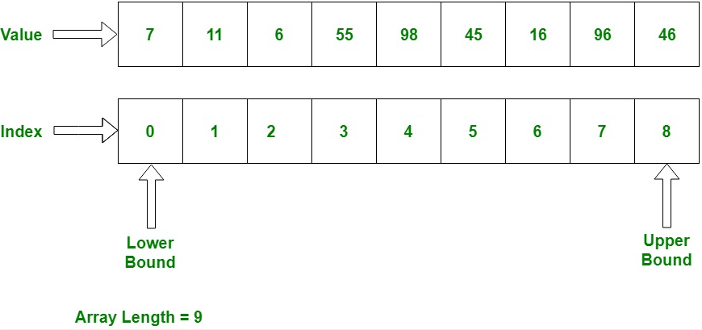

# Arrays

An array is an **indexed** data type that holds items of the **same type**, so every item in an array takes up the same amount of space in memory and in most programming languages an array is implemented as a **static datatype** which means its size is fixed at creation time and cannot be changed at runtime.

Entries in an array are called **elements** and each element in an array is identified by an index which usually starts from zero [0] and identifies the elements position in the array, in manyy programming languages an array is specified using a pair of square brackets.

All arrays consist of **contiguous memory locations**, the lowest address corresponds to the first element and the highest address to the last element. This makes array access extremely fast and generally accessing an element in an array is in constant time, Θ(1). 

When an array is accessed, and because the elements in an array are contigous in memory the starting address is retrieved and then the index is added to it in order to get the address of the element that is to be retrieved. Attempting to access an element value outside the upper or lower boundary of an array will result in the programming languages equivelent of an ArrayIndexOutOfBoundException, that is that code has attempted to use an index which is out of bounds for the array in question.

To access the element at the 56th location in an array in java, the following syntax is used:

```Java
int foo = arr[55];
```

In terms of machine code this roughly translates to:

* Get the starting memory address of arr into A

* Add 55 to A

* Take the contents of the memory address in A, and put it in the memory address of foo

These three instructions all take Θ(1) time on a standard machine and so this is Θ(1).

## Diagram of an Array

<p align="center">
  
</p>

