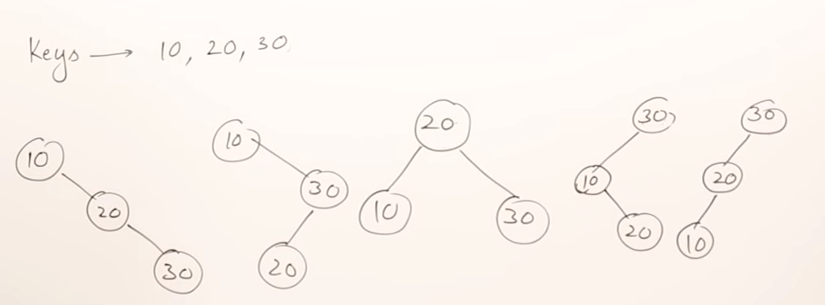

# Binary Search Tree Datatype

A binary search tree is a binary tree that follows a strict order for any node *n* all nodes in its left sub tree will be smaller than it,
and all nodes in its right sub tree are greater than it.

Binary search trees support the dynamic set functions INSERT, DELETE and SEARCH and in the worst case each operation takes Θ(n)

The cost of searching in a binary tree is based on the number of comparisons that need to be performed, a tree can be balanced or unbalanced and
if values are inserted in increasing order a binary search tree can end up becoming a simple linked list where the cost of searching is O(n).

For a given number of *keys** there will be multiple possible representations of a binary search tree, for example given the keys **10, 20, 30** and one of them is more preferable due to the number of comparisons needed to locate a value.

  

In the trees in the diagram above 4 of the trees which arranged as linked lists will have a cost of 6/3 when searching for values, whereas the tree which is height balanced has a cost of 5/3.

## Properties of binary search trees

* The minimum height of a binary search tree is *log n*
* All nodes to the left are smaller, a node is greater than every node in its left subtree
* All nodes to the right are larger, a node is smaller than every node in its left subtree

## Binary Search Tree Operations

A binary search tree supports the following operations:

* Insert
* Delete
* Search

### Insert

### Delete

### Search