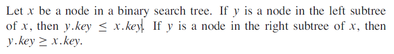
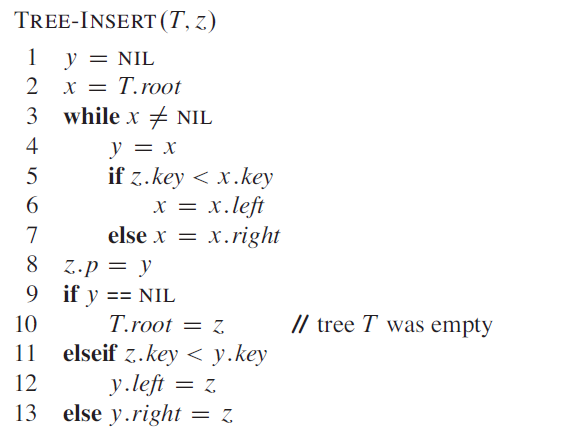
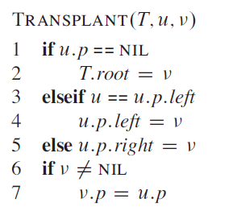
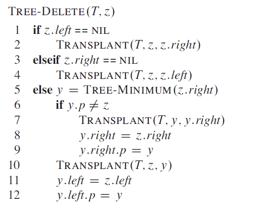
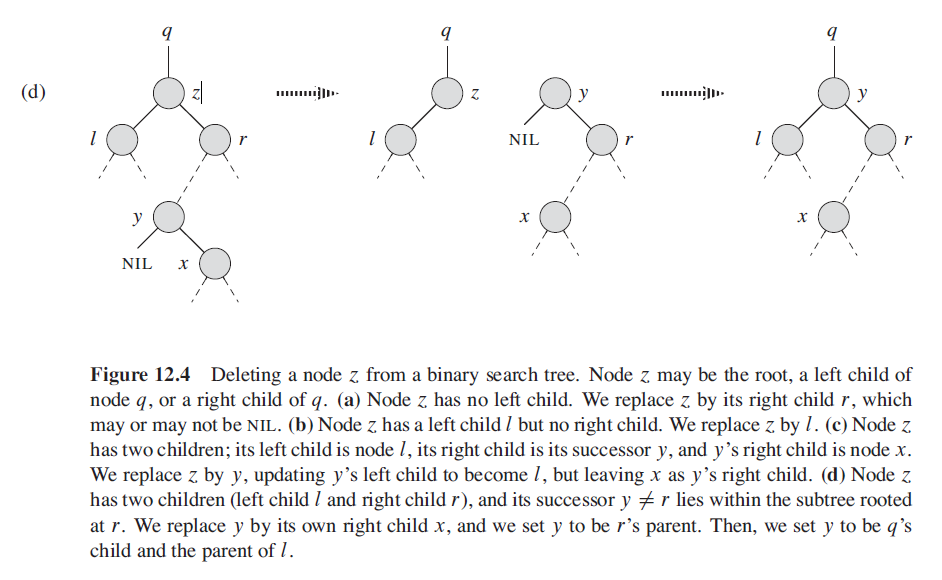
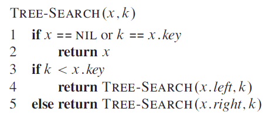
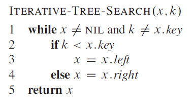
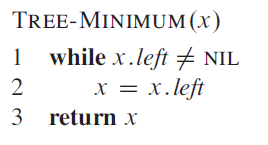
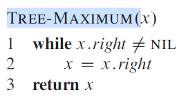
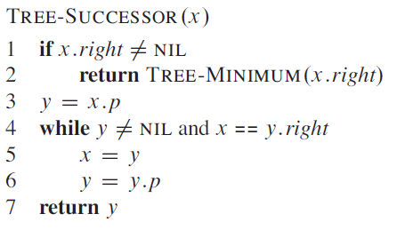

# Binary Search Tree Datatype

A binary search tree is a binary tree that follows a strict ordering, for any node *n* all nodes in its left sub tree will be smaller than it,
and all nodes in its right sub tree are greater than it.

Binary search trees support the dynamic set functions `INSERT`, `DELETE` and `SEARCH` and in the worst case each operation takes `Θ(n)`

The cost of searching in a binary tree is based on the number of comparisons that need to be performed, a tree can be balanced or unbalanced and
if values are inserted in increasing order a binary search tree can end up becoming a simple linked list where the cost of searching is`O(n)`.

For a given number of *keys** there will be multiple possible representations of a binary search tree, for example given the keys **10, 20, 30** and one of them is more preferable due to the number of comparisons needed to locate a value.

A binary search tree can be represented using a linked data structure in which each node is an object, in addition to a *key* and some satellite data each node contains attributes *left*, *right* and *p* that point to the nodes left child, right child and parent.

If a child or a parent is missing its value is represented by `NIL`, the root node is the only node whose parent is `NIL`.

The keys in a binary search tree are stored in such a way as to always satisfy the ***binary search tree property***.

  

In the trees in the diagram above 4 of the trees which arranged as linked lists will have a cost of 6/3 when searching for values, whereas the tree which is height balanced has a cost of 5/3.

## Properties of binary search trees

When the properties of a binary search tree are held then all of the values can be printed in sorted order by using a recursive ***in order tree walk***, where the order of node visitation is L, N, R meaning the lower value is printed, then the parent node value, then the right node value. In order tree walk takes `Θ(n)` time.

  

* The minimum height of a binary search tree is *log n*
* All nodes to the left are smaller, a node is greater than every node in its left subtree
* All nodes to the right are larger, a node is smaller than every node in its left subtree

## Binary Search Tree Operations

A binary search tree supports the following operations:

* Insert
* Delete
* Search
* Minimum
* Maximum
* Predecessor
* Successor

In the worst case binary search tree operations are in the order of `Θ(n)` on a tree with *n* elements, on randomly built binary search trees the expected time for each operation is considered to be `O(log n)`, that is proportional to the height of the tree.

In practice we cannot always guarantee that a binary search tree is randomly built and so variations such as red black trees whicn enforce balancing of the tree can be considered instead as these give guaranteed worst-case performance on basic operations.

The operations `INSERT` and `DELETE` change the structure of the tree and so we must ensure that the ***binary search tree** property continues to hold after the search tree is modified.

Inserting a new element is fairly straightforward, deleting an element is more complex.

### Insert

To insert a new value *v* into the tree *T* we use the procedure `TREE-INSERT`. This procedure takes a node *z*, for which *z.key* = *v*, *z.left* = `NIL` and *z.right* = `NIL`. The procedure modifies *T* and some attributes of *z* such that *z* is inserted into its appropriate position in the tree.

  

Tree insert runs in `O(h)` time on a tree with a height *h*.

### Delete

Deleting a node *z* from a binary search tree *T* has three basic cases, although one of them is complex.

* If *z* has no children we simply remove it by modifying its parent *p* to replace *z* with `NIL`
* If *z* has just one child then the child is elevated to take the position of *z* but modifying *z*'s parent to replace *z* with *z*'s child
* If *z* has two children then we must find *z*'s successor *y* and have *y* take *z*'s position in the tree. The rest of *z*'s original right
subtree becomes *y*'s new right subtree, and *z*'s left subtree becomes *y*'s new left subtree.

In order to move subtrees around in a binary search tree we define a subroutine `TRANSPLANT`, which replaces one subtree as a child of its parent with another subtree.

  

  

When deleting from a tree with two children:

  

### Search

`TREE-SEARCH` begins at the root of the tree and traces a simple path down through the tree by comparing the value being searched for. At each node *x* the key *k* is compared with *x.key*, if it is equal the search terminates, if *k* is smaller the search progresses down through the left sub tree, if *k* is greater the search continues down through the right sub tree, the running time is `O(h)`.

  

This recursive function can be rewritten in an iterative fashion and in general this will run faster on most computers.

  

### Minimum and Maximum

Finding the minimum element in a tree means following the *left* child pointers from the root until we encounter a `NIL`. The binary search tree property will guarantee that `TREE-MINIMUM` is correct.

  

`TREE-MAXIMUM` is symmetric, the right path will eventually lead to the largest value.

  

For a tree of height *h* both of these procedures will run in `O(h)` time on a tree of height *h*, as similarly to search the nodes encountered form a simple path from the root downward.

### Successor and Predecessor

Given a node in a binary search tree, find its successor using an ***in order tree walk***, the successor of a node *x* is the node with smallest key greater than *x.key*, due to structure of the tree we can determine the successor without ever comparing keys.

  

If the right subtree of *x* is non empty then the successor is found by simply returning the `TREE-MINIMUM` of the right subtree.

If the right subtree of *x* is `NIL` however and *x* has a successor *y* then *y* is the ***lowest ancestor of x whose left child is also an ancestor of x***.

The runtime of `TREE-SUCCESSOR` on a tree of height *h* is `O(h)` since a simple path is followed up or down the tree.

`TREE-PREDECESSOR` is symmetric to `TREE-SUCCESSOR` and also runs in `O(h)`.

In summary we have proved the theorem that we can implement the dynamic set operations `SEARCH`, `MINIMUM`, `MAXIMUM`, `SUCCESSOR`, and `PREDECESSOR` so that each one runs in `O(h)` time on a binary search tree of height *h*.