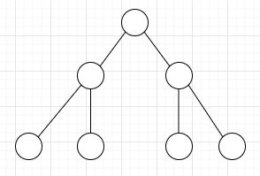
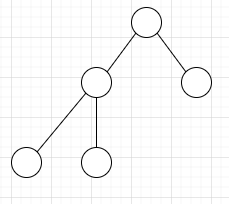
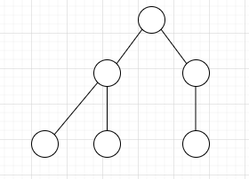

# Binary Tree Data Type

A binary tree is a tree in which each node has at most two children, which are referred to as the *left child*, and the *right child*. A binary tree is *undirected* is *ordered* and *rooted*.

Binary trees have a number of uses including binary search trees, heaps and as a data representation for huffman encoding tables.

## Properties of binary trees

* A tree consisting of only a root node has a height of 0
* The depth of a binary tree is calculated by the number of edges from the root node to the longest path leaf node
* The height of a binary tree is calculated by the number of edges from the longest path leaf node to the root node
* The depth of the root node is 0
* The height of a leaf node is 0
* If a node has index *i* its left child is found at index 2*i*
* If a node has index *i* its right child is found at index 2*i* + 1
* A nodes parent is found at the floor of *i*/2

## Full Binary Tree

A full binary tree is a binary tree where ***every node has exactly two children, or is a leaf node***.

The tree below is both full and complete, every node is either a leaf or has exactly two children so all internal nodes have degree 2 and all leaves are at the same depth.

  

The tree below is full but it is now ***incomplete***, this is because it has leaves that are not at the same depth.

  

The tree below is no longer full because the right child node of the root node is now an *internal node*, so no longer a leaf and it has only one child node.

  

## Nearly Complete Binary Tree

A nearly complete binary tree is a tree where all internal nodes ***except those on the last level*** have exactly two children and all leaf nodes are filled from the left. This type of tree is also referred to as a *complete binary tree* in some literature.

The tree below is nearly complete as it meets the criteria above but it also fails to meet the criteria for a **full tree** which says that all leaf nodes must have the same depth.

  

The tree below is nearly complete but it is no longer full because it violates the full tree property that a node should either be a leaf, or have exactly two children

  

## Complete Binary Tree

A complete binary tree is a tree with all leaves at the same depth, and all internal nodes have a degree 2. This type of binary tree is called a **perfect binary tree** in some literature.

  

