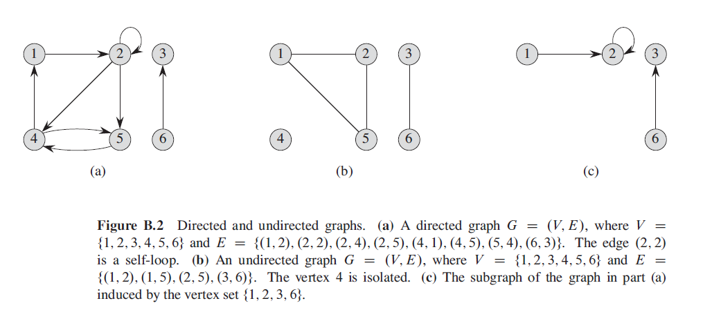
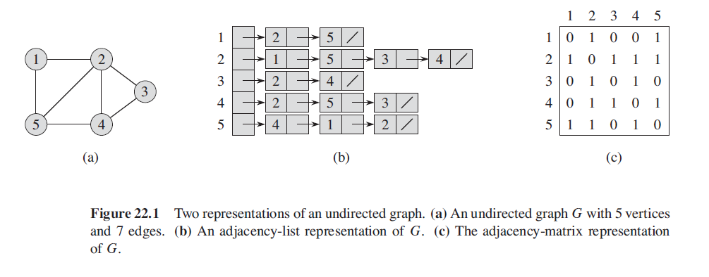
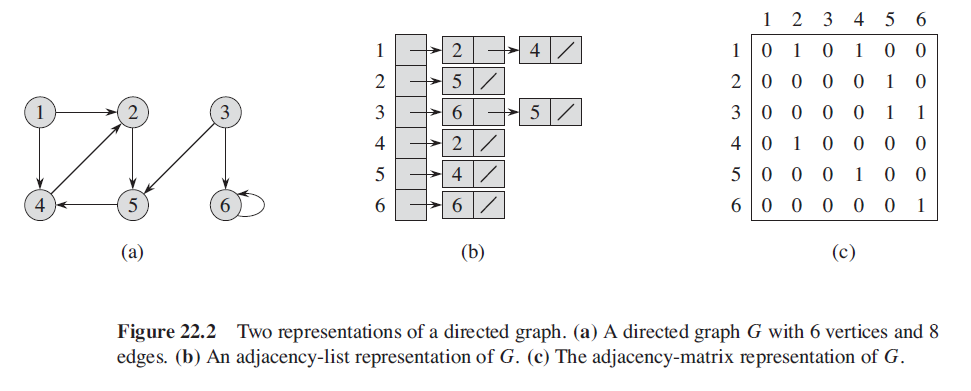

# Graph Data Structures

We will talk about two types of graph ***directed*** and ***undirected*** and the CLRS book yet again seems to use differing terminology.

A ***directed graph***, also known as a diagraph  *G* is a pair `(u, v)` where *V* is a finite set and *E* is a binary relation on *V*. The set *V* is called the ***vertex set*** of *G* and its elements are called ***vertices***.

The set *E* is called the ***edge set*** of *G* and its elements are called ***edges***, vertices are represented by circles on the graph below, and edge by arrows, ***self-loops***, edges from a vertex to itself are allowed on directed graphs only.

In an ***undirected graph*** *G = `(V, E)`* the edge set *E* consists or *unordered* pairs of vertices, rather than ordered pairs. By convention the notation `(u, v)` is used over the set notation `{u, v}` and we consider `(u, v)` to be the same edge as `(v, u)`.

Below is pictorial representation of a directed and undirected graph, along with a sub graph of the directed graph.

  

## Graph Terminology

* Vertex - A vertex is a node on a graph, represented by a circle
* Edge - An edge is a connection between two vertexes on a graph
* Directed Graph - When edges have a directional arrow, inwards or outwards
* Undirected Graph - Edges do not have a direction associated with them
* Path - A path from vertice *u* to *v* via connected edges, in this instance we say that *u* is *reachable* from *v*
* Weighted Graph - If edges have a weight then the graph is said to be *weighted*
* Adjacent - If there is an edge `(u, v)` then ***b*** is adjacent to a
* Incident From - If `(u, v)` is an edge then `(u, v)` is ***incident from*** or ***leaves*** vertex *u*
* Incident To - If `(u, v)` is an edge then `(u, v)` is ***incident to*** or ***enters*** vertex *u*
* Connected - An undirected graph is connected if every vertex is reachable from all other vertices.
* Strongly Connected - A directed graph is strongle connected if every two vertices are reachable from each other
* Weakly Connected - A directed graph is classed as a weakly connected if when not considering the direction of edges it is possible to reach any node from any other
* Cycle -  In a directed graph if `v0...vk` and `v0 = vk` then a ***path*** if formed
* Simple Cycle - The cycle is said to be simple if in addition to the properties above, the vertexes `v1...v2` are distinct
* In-degree - The number of inward edges to a vertex, on a directed graph
* Out-degree - The number of outward edges from a vertex, on a directed graph
* Degree - The sum of the in and out degree
* Isolated - A vertex with degree 0

## Graph Representation

There are two standard ways to represent a graph `G = (V, E)`,as a collection of adjacency lists or as an adjacency matrix. Both ways apply to directed and undirected graphs.

### Adjacency Lists

Adjacency lists provide a compact way to represent a ***sparse graph***, that is a graph for which *E* is much less that *V*.

  

### Adjacency Matrices

If the graph is ***dense***, *E* is close to *V* or if we quickly need to tell if there is an edge connecting two given vertices then an adjacency matrix representation should be used.

  

## Depth First Searching

## Breadth First Searching
