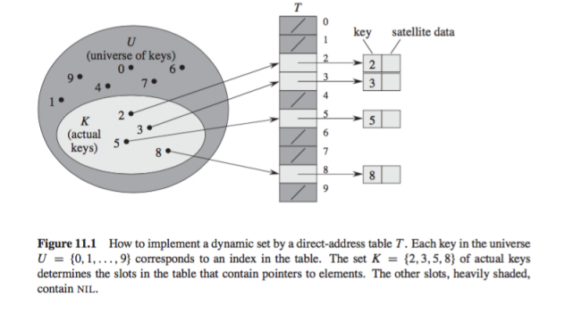
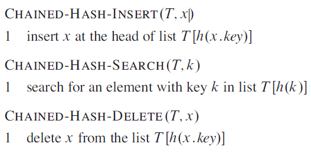

# Hash Tables and direct addressing

## Direct Address Tables

A direct address table is a type of data structure that maps records to values in an array using a key value which is **hashed** to represent some element in a corresponding array. Direct addressing enables fast insertion, retrieval and deletion operations on data items.

Direct addressing is a technique that works well when the **universe** of potential keys is reasonably small:

`U = {0, 1, ..., m-1}`

Generally we also assume that ***no two elements have the same key*** and to represent the dynamic set we use an array (also called a **direct address table**), represented as:

`T[0, 1, ..., m-1]`

An array can be built `T[0...m-1]`, where an element with key ***k*** is placed at `T[k]` and `T[i] = NIL` if there is no element in the data structure with the key ***i***.

In the following diagram each position or slot in the table ***T***, corresponds to a key in the universe ***U***.

  

Direct address tables support the following functions:

* SEARCH in **O(1)** time
* INSERT  in **O(1)** time
* DELETE in **O(1)** time

## Hash Tables

When the number of keys that need to be held as part of the data structure are large it becomes impractical to use a direct address table, and instead it becomes more feasible to use a hash table.

A hashtable is a data structure that allows for very fast retrieval of data, regardless of how much data there is. Hashtables are widely used in caching and database indexing.

## Hashing Algorithm

A hashing algorithm is a calculation applied to a key to transform it into an address. For example a numeric key can be divided by the number of available addresses ***n*** and the remainder can be used as the index value.

For alphanumeric keys the sum of the ASCII code values of the characters that make up the key can be divided by the number of available addresses ***n*** and the remainder can be used as the index value.

Another method that can be used is **folding** where a number such as a telephone number of 01452 8345654 becomes `01 + 45 + 28 + 34 + 56 + 54 = 218` and this may then be divided by some constant ***c*** and the remainder used as the index value.

Hashing algorithms will always have the potential to generate the same hashcode for a different key, and when this happens a ***collision*** occurs.

A good hash function satifies (approximately) the assumption of ***simple uniform hashing***, where each key is equally likely to hash to any of the available slots.

## Collisions

When the hash function of two different keys produces the same hashed value then two keys will be hashed to the same slot, this is known as a collision.

Whilst the ideal scenario is a hashing algorithm that does not produce, or at least minimises collisions there are effective techniques for resolving conflicts related to collisions.

One idea is to make *h* appear to be 'random' therefore attempting to limit collisions, but a hashing algorithm must be deterministic in that it should always produce the same output for a given input *k*.

So whilst a well designed hashing algorithm can go a long way towards *minimising* collisions we still need a mechanism for dealing with them when they do occur.

### Open Hashing

The term open hashing refers to the fact that items are not closed to be storing in the hashtables internal array.

#### Chaining

With ***chaining*** all elements that hash to the same slot as placed into the same linked list, when a new item needs to be stored it is saved at the head of the list, so inserting an element runs in `O(1)` time.

For searching, the run time is proportional to the length of the linked list, an element can be deleted in `O(1)` if the list is doubly linked, a singly linked list has the same deletion runtime as searching because an element *x* has to be located first so its ***previous***.

#### Load Factor

A load factor is applied to a hashtable that is using chaining, the load factor ∝ for *T* is *n* / *m*, that is the average number of elements stored in a chain.

#### Simple Uniform Hashing

This is the assumption that any element is equally likely to hash into any of the *m* slots, independently of where any other element hashed to.

  

The average case complexity of chaining is dependent on the hashing algorithm being used, clearly the worst case is that all keys hash to the same value and so the hashtable ends up being a list of *n* items.

### Open Addressing (Closed Hashing)

The term closed hashing refers to the fact that items are closed, that is they never leave the hashtables internal array, unlike chaining described above where only a reference to the first 'chained' item is stored in the hashtables array, ***Open Addressing*** refers to the fact that the elements can *spill out* of their preferred place in the underlying array if a collision happens and so occupy some other slot.

In open addressing all elements occupy the hashtable, each table contains either an element of the dynamic set or `NIL`, no elements are stored outside the table unlike with chaining.

With open addressing the hashtable can fill up so that no further insertions can be made, as such the load factor ∝ can never exceed 1. One advantage of open addressing is that the use of pointers is completely avoided, instead of using pointers the address is *computed*.

Rehashing schemes, where the hash is recalculated if there is a collision are used when open addressing is being used.

#### Linear Probing

Linear probing is the most simple of techniques for finding a new slot when a collision occurs, the rehashing function simply adds +1 to the generated hash, if that slot is occupied then the same is done again until an empty slot is found. If the end of the array is reached then the array is searched from the beginning up until `h(k) - 1`.

Linear probing is easy to implement but it suffers from a problem known as ***primary clustering***, long runs of occupied slots build up increasing the average search time.

Clusters arise because an empty slot preceded by *i* full slots gets filled next with probability (*i* + 1) / *m*. Long runs of occupied slots tend to get longer and the average search time increases.

Deletion is also more complicated when using linear probing, an item cannot simply be deleted because when looking up an item it could have the potential not to be found, if the search were to come across an empty slot it would stop searching, so for this reason ***tomb stones*** are often used. Instead of deleting the element from the slot and allowing the slot to remain empty it is marked for deletion, until an item is inserted into its place.

#### Quadratic Probing

Quadratic probing uses a hash function of the form (`h'` is a auxilliary hashing function):

`h(k, i) = (h'(k) + c1 * i + c2 * i^2) mod m`

This method works better than linear probing but in order to make full use of the hashtable the values of c1, c2 and m are constrained. If two keys have the initial probe then their probe sequence will be the same and this can lead to a mild form of clustering calling ***secondary clustering***, as with linear probing the initial probe determines the entire sequence so only *m* distinct probe sequences are used.

The course notes describe the quadratic probing function to operation like:

* Examine `h + 1`
* Examine `h + 2^2`
* Examine `h + 3^2`
* Examine `h + 4^2`

And so on..

#### Double Hashing

Double hashing offers one of the best methods available for open addressing because the permutations produced have many of the characteristics of randomly
chosen permutations.

The initial probe goes to position `T[h1(k)]` successive probe positions are offset from previous positions by the amount h2(k), modulo *m*. Thus, unlike the case of linear or quadratic probing, the probe sequence here depends in two ways upon the key k, since the initial probe position, the offset, or both, may vary.