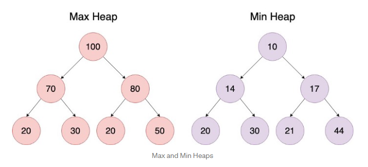
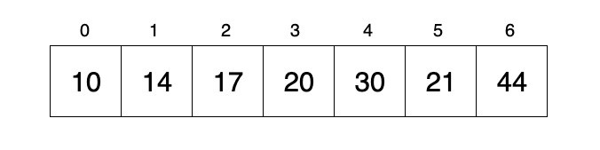

# Heaps

A heap is a  a *complete binary tree* data structure which has specific tree ordering properties and can be one of the following two types:

* Max Heap: The value of each node is less than or equal to its parent node, for all sub trees

* Min Heap: The value of each node is greater than or equal to its parent node, for all sub trees

To find the minimum number of elements in a heap use: *2h*

To find the maximum number of elements in a heap use: *2h+1 -1*

  

It is important to remember that heaps are ***not sorted***, there is no relationship between nodes at any level other than the the standard parent\child and sibling relationships formed by being part of the tree.

A heap is a ***complete binary tree***, the height of a tree with **N** nodes has a height of **O(log N)**.

## When is a heap useful

A heap of either type will have the highest or lowest value in the collection at the root of the tree. Therefore finding the highest or lowest value in the tree is in the order of ***O(1)***, so one example of a time when using a heap is appropriate is when implementing a priority queue.

As heaps only provide fast access to the smallest or the largest value in the array finding other items takes ***O(n)*** time due to the fact that there is no specific ordering present, and so all nodes must be examined to find any particular value.

## Heap Implementations

Heaps are usually implemented using an array, where the root of the heap is the first item in the array and the child nodes and sub trees are located using an offset. Considering the following array:

  

When looking for the **i-th** element in a one based array:

* Find the parent at the ***floor i / 2*** index
* Find the left child at ***2 * i*** index
* Find the right child at ***2 * i + 1*** index

When looking for the **i-th** element in a zero based array:

* Find the parent at the ***floor (i - 1) / 2*** index
* Find the left child at ***2 * i + 1*** index
* Find the right child at ***2 * i + 2*** index

In a ***complete binary tree*** each level is filled up before another level is added to the tree and levels are always filled from left to right. The CLRS textbook uses different terms to describe trees, a heap is classed as a **nearly complete** binary tree and not **complete**.

### Inserting into a heap

1. Add the node to the bottom of the tree
2. Examine the parent node, if the parent node is greater than (or less than) swap them
3. Continue to compare and swap until the node has reached a position where it finds a parent that is either smaller or larger than it

#### Cost of insertion

The height of a tree is ***log(n)***, so in the worst case any newly inserted node is smaller or larger than every parent node, which means the entire tree has to be traversed costing *O(log(n))*.

### Deleting from a heap

A heap will have either the largest or smallest node at the root so we always know where it is, so deleting the largest or smallest node is a constant time operation.

However when deleting the root element the entire tree must be shifted upwards one place.

1. Take the right most element of the bottom level of the tree and move it to the top, replacing the root node
2. Compare the new root node to its children, if it is larger (or smaller) than either child swap it with the smaller of the two
3. Continue to swap and compare until the node bubbles down to its natural position

As with inserting a node, deleting a node, in the worst case requires that the entire tree is traversed, from the top down, the cost of this operation is ***O(log(n))***.

### Converting an unordered array into a heap

We can easily create a min or max heap from an unordered array by bubbling down smaller or larger values to the bottom of the array.

In order to do this we need to start at the root node of the tree (index[0]) in the array and compare this node with both of its children. We check to see if a child node is either bigger or smaller and then swap and continue to do so until a tree is formed and the heap structure is in place.

As a binary heap is a **complete binary tree** (**nearly complete** in CLRS terms) there will be *n/2* nodes on the bottom level, *n/4* nodes on the second to last level and so on, each time we go up a level the number of nodes halves. So the worst case time complexity for this will be ***O(n)***.
