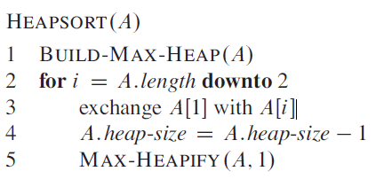

# Heapsort Algorithm

Heapsort is a sorting algorithm that sorts *in place* like insertion sort, but has a running time of `O( n log n)` like merge sort, so it combines the better attributes of the two sorting algorithms. Heapsort introduces a useful data structure called a heap, which is used during heapsort and for implementing priority queues.

## The heap data structure

A heap is a **nearly complete binary tree** in CLRS terms and so is formed using an array and can be represented as a tree structure, in CLRS terms a **complete binary tree** is a tree in which all internal nodes have degree 2 and all leaves have the same depth, for such a tree:

Total number of internal nodes: `2^h - 1`

Total number of leaves: `2^h`

Using the formulas above a complete binary tree with a height of 4 will have:

* 15 internal nodes (`2 * 2 * 2 * 2 - 1 = 15`)
* 16 leaf nodes (`2 * 2 * 2 * 2 = 16`)

A complete or nearly complete binary tree will have a height of `log n`.

The minimum number of elements in a heap of height ***h*** is: `2^h`

The maximum number of elements in a heap of height ***h*** is `2 ^ h + 1 - 1`

For the same heap with a height of 4:

Minimum nodes is 16 (`2 * 2 * 2 * 2 = 16`)

Maximum nodes is 31 (`2 * 2 * 2 * 2 * 2 - 1 = 31`)

## Heap Sort

For the heapsort algorithm typically we use max heaps, min heaps are commonly used for implementing priority queues, since a heap of *n* elements is a nearly complete binary tree its height is `Θ(log n)` and basic heap operations run in `O(log n)` time.

The `HEAPSORT` procedure runs in `O(n log n)` time and starts by calling `BUILD-MAX-HEAP` in order to create a max heap on the input array *A[1..n]*, since the maximum element is now placed at the root of the tree it can then be exchanged with *A[n]*.

If node *n* is now discarded from the heap, and this can be done by simply decrementing `A.heap-size` the children of root maintain the max heap property but the root itself may no longer do so and potentially violates the max heap property.

Now `MAX-HEAPIFY` can be called again and the process repeated until the array is sorted in ascending order down to a heap of size 2.

The `HEAPSORT` procedure takes time `O(n log n)`, since the call to `BUILD-MAXHEAP` takes time `O(n)` and each of the *n* - 1 calls to `MAX-HEAPIFY` takes time `O(lg n)`.

  

## Max Heapify

  

