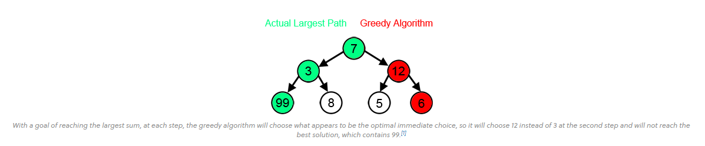
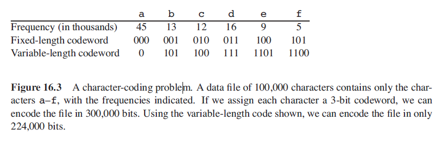
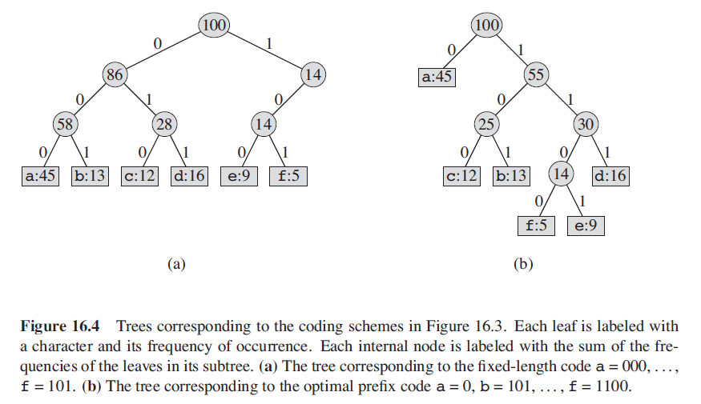
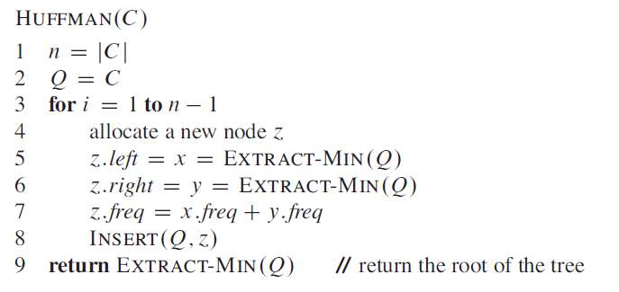

# Huffman codes and Huffman Encoding

A Huffman encoding tree is a heap based greedy algorithm for encoding text data to save memory space, the algorithm is said to be greedy because it makes the optimal choice at each step, although this may end not actually being the best option, in many problems a greedy algorithm does not actually make the most optimal solution.

  

## Priority Queues

One of the most popular applications of a heap is as a priority queue, and a ***min priority*** queue can be used in the construction of a Huffman Encoding tree for text compression, heaps also support ***max priority queues***.

A priority queue is a data structure for maintaining a set of *S* elements, each with an associated value called a ***key***.

### Min Priority Queues

A min priority queue supports operations such as `INSERT`, `MINIMUM`, `EXTRACT-MIN` and `DECREASE-KEY` and can be used in an event driven simulator where the items in the queue are events to be simulated, the key is the time of occurance and the events must be triggered according to their time of occurance as the simulation of one even could lead to the triggering of another.

## Huffman Encoding

Huffman codes compress data very effectively and saving of between 20% and 90% are typical, depending on the characteristics of the data being compressed. Huffmans greedy algorithm uses a table giving how often each character occurs (its frequency) to build up an optimal way of supporting each character as a string. Huffman encoding follows the ***optimal merge pattern*** to construct an encoding tree, characters are arranged in increasing order of frequency, so the smallest nodes are merged to form a node.

Given an example where we would like to encode a `100,000` character data file and only the letters a-f appear in the file, so there are only 6 different characters in the file, but the character *a* appears `45,000` times there are many options for representing this information.

  

If a ***fixed length*** encoding scheme is used then 3 bits are needed to represent 6 characters, `a = 000`, `b = 001`, `...`, `f = 101`, so this method requires `300, 000` bits to code the entire file, Huffman coding uses variable length codes.

If using a ***variable length*** code then we can give frequent characters short codewords and infrequent characters longer code words then for the same file we can achieve the encoding using only `224, 000` bits, a saving of 25%.

A ***prefix code*** is actually a a ***prefix free code*** and using this encoding style means that no prefix is also a code and so this simplifies decoding, no codeword (for example `0 = a`) is a prefix for any other codeword so all codewords are ***unambiguous***.

  

The binary codeword for a character can be interpreted as the single path from the root node to that character, where a `0` means go to the left child, and a `1` means go to the right child.

Its important to note that these trees are ***not*** binary search trees and leaves need not appear in sorted order, and internal nodes do not contain character keys. An optimal code for a tree is always represented by a ***full binary tree***.

As the encoding table is represented as a full binary tree we can now say:

* If *C* is the alphabet and all character frequencies are positive then the tree for an optimal prefix code has ***exactly*** *|C|* leaves, one for each letter of the alphabet *C*

* The tree *T* has exactly *|C| - 1* ***internal nodes***

* Sum of h * freq for all leaf nodes will give the total size in bits needed for the codes

## Building a huffman tree

  

An optimal code for a file is always represented as a ***full binary tree*** in which every non leaf node has two children.