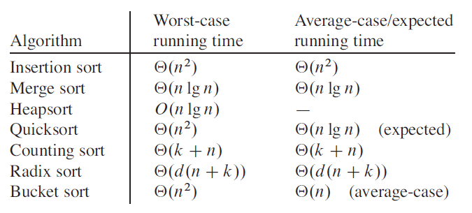
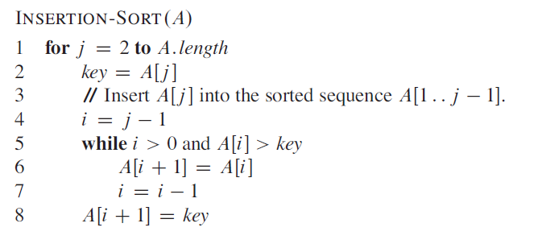
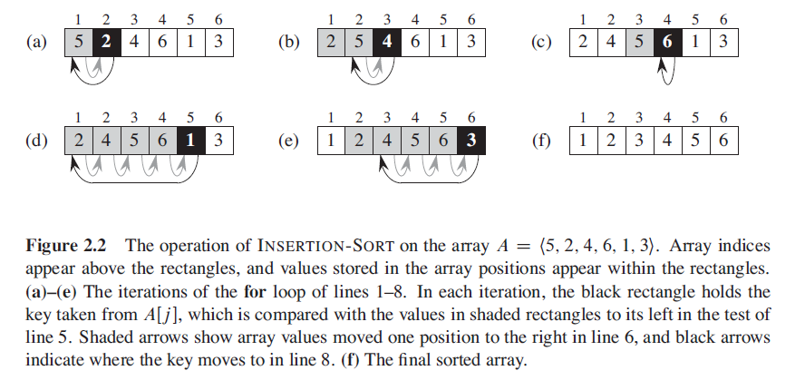

# Insertion Sort Algorithm

Insertion is a sorting algorithm that sorts *n* real numbers in an array. It sorts ***in place*** and therefore uses less memory space since only a constant number of elements are ever kept outside of the array being sorted. Whilst insertion sorts time complexity is `Θ(n^2)` it has a very tight code meaning the constant factor is low and the running time is small, insertion sort is suitable for sorting small input sizes.

Merge sort has a better asymptotic running time, `Θ(n log n)`, but the `MERGE` procedure does sort in place.

  

Insertion sort (along with merge sort, quick sort and heap sort) is a comparison sort, the algorithm determines the sorted order of the input array by comparing elements. 

Insertion sorts works in the way many people sort a hand of cards, starting with an empty left hand and the cards face down on the table, one card at a time is picked up and inserted into its correct position in the hand.

To find the correct position for a card, it is compared with each of the cards currently in the hand from left to right, at all times the cards held in the left hand are sorted.

## Pseudocode for insertion sort

  

## Operation of insertion sort

  

