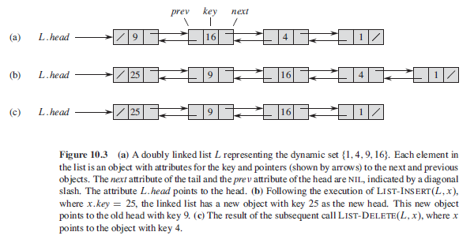
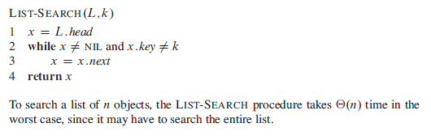
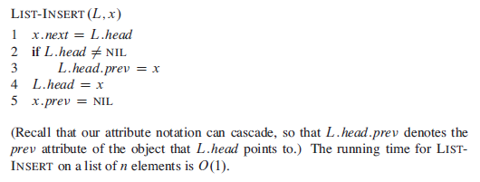
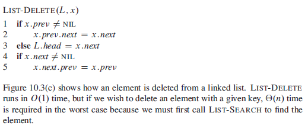
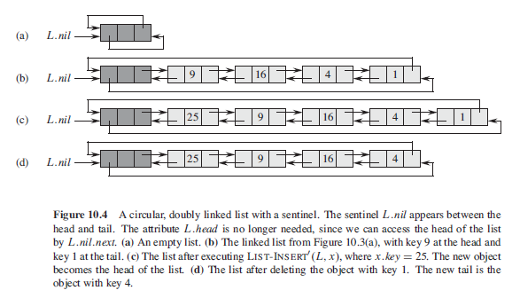
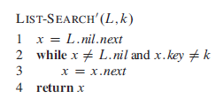
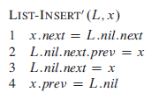
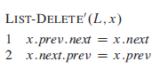

# Linked List Data Structure

The linked list data structure is another type of dynamic set, like stack and queue, objects in a linked list are arranged in a linear order. Lists often maintain insertion order of elements added to them. Unlike an array where the linear order is determined by array indices, a linked lists order is maintained by a pointer to the next element in the list.

A linked list can take several forms, the list can be singly or doubly linked, it can be sorted or unsorted based on the keys and may or may not be circular. If the list is **singly linked** then the each element does not hold a *prev* pointer which references the element that comes before it, if the list is *sorted* then the order corresponds to the order of the keys stored in the list, if the list is **unsorted** then the elements can appear in any order.

If the list ic **circular** in nature then the *prev* pointer of the head elements points to the **tail** element and the *next* pointer of the tail element points to the *head* element and the list can be thought of as a *ring* of elements.

# Linked List Diagram

  

# Linked List Operations

## Search

The function *LIST-SEARCH(L, k)* below finds the first element in the list *L* with the key *k* using a linear search and then returns a reference to *k*, if no object matching *k* is found then the function returns *NIL*.

  

## Insert

  

## Delete

  

# List Sentinel

  

## Search with Sentinel

  

## Insert with Sentinel

  

## Delete with Sentinel

  

