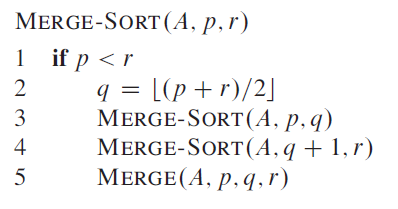
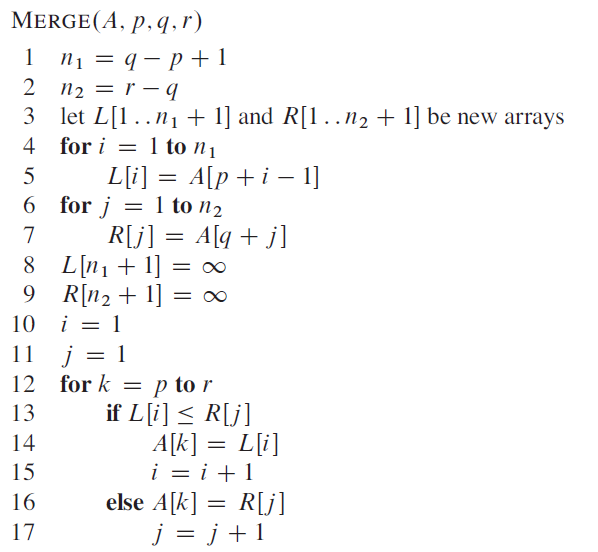
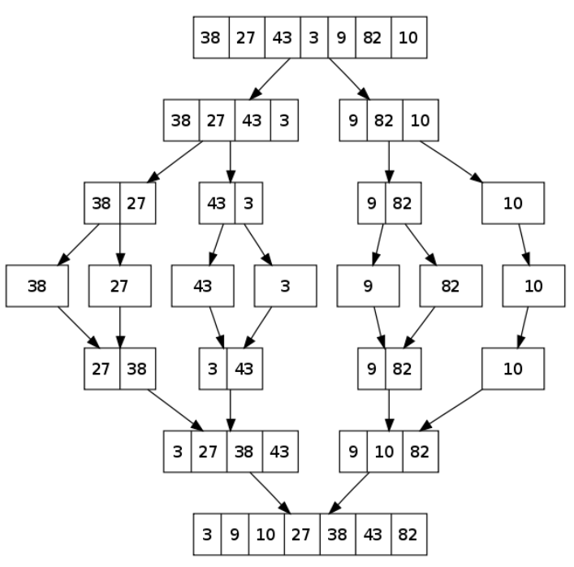

# Merge Sort Algorithm

Insertion is a ***divide and conquer*** sorting algorithm which can achieve a lower order of growth than insertion sort in the worst case. Merge sort breaks the problem down in smaller and smaller sub problems recursively until it is sorting a single element which is naturally sorted.

These solved sub-problems are then ***merged*** back together to form the sorted array, and so insertion sort takes in the order of `Ө(n2)` in the worst case.

## Divide and Conquer

A divide and conquer paradigm involves three steps:

* ***Divide*** the problem into a number of subproblems that are smaller instances of the same problem
* ***Conquer*** the subproblems by solving them recursively. If the subproblem sizes are
small enough, however, just solve the subproblems in a straightforward manner
* ***Combine*** the solutions to the subproblems into the solution for the original problem

Merge sort follows this pattern:

* ***Divide***: Divide the n-element sequence to be sorted into two subsequences of n=2
elements each
* ***Conquer***: Sort the two subsequences recursively using merge sort
* ***Combine***: Merge the two sorted subsequences to produce the sorted answer

The recursive nature of the function stops when the input size is *1* because technically a single element array is sorted.

In order to merge elements together we call an auxilliary function `MERGE(A, p, q, r)`, where *A* is some array and *p*, *q* and *r* are indices into the array such that *p* <= *q* < *r*.

The procedure assumes that the sub arrays are in sorted order and so it ***merges*** them together into a single sorted sub array that replaces the current sub array. The merge procedure takes `Ө(n2)`.

### Merge Sort Pseudocode

  

### Merge Pseudocode

  

### Merge Sort Process

  

