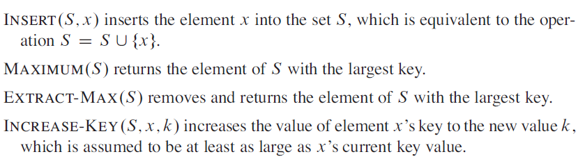
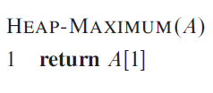
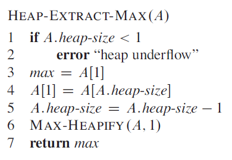
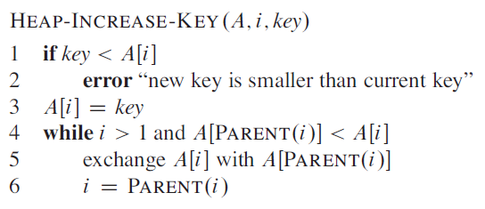
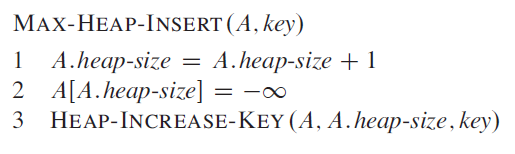

# Priority Queues

Whilst quicksort generally beats heapsort in terms of efficiency the heap data structure has many uses and one of them is the implementation of a *priority queue*. Like heaps, priority queues come in two forms, *min priority queues* and *max priority queues*.

A priority queue is a data structure used to maintain a set **S** of elements, each with an associated value called a *key*.

One of the applications of max priority queues is for job scheduling on a shared computer where the max priority queue keeps track of the jobs to be performed with their relevant priorities.

A *max priority queue* supports the following operations:

  

The procedure `HEAP-MAXIMUM(A)` implements the `MAXIMUM` operation in `Θ(1)` time:

  

The procedure `HEAP-EXTRACT-MAX` implements the `EXTRACT-MAX` operation and its running time is at worst `O(log n)`:

  

The operation `HEAP-INCREASE-KEY` repeatedly compares an element to its parent and exchanges their places in the tree if the elements key is larger, terminating if the elements key is smaller.

  

The running time of `HEAP-INCREASE-KEY` on a *n-element* heap is `O(log n)` as it based on the height of the tree, the min height of a tree is always *log n*.

The procedure `MAX-HEAP-INSERT` implements the `INSERT` operation and takes as an input the key of the new element to be inserted in the max heap *A*. First appends the new element to the end of the array as this represents the left most free spot in the tree and it then calls `HEAP-INCREASE-KEY` to the key of this new node to its correct place in the tree, and so maintaining the max-heap property. The running time of `MAX-HEAP-INSERT` on an n-element heap is `O(log n)`.

  

In summary a heap can support any priority queue operation in `O(log n)` time on a set of size *n*.
