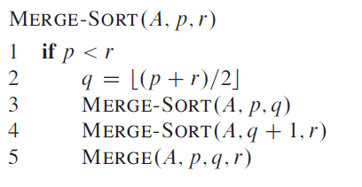

*# Pseudocode Conventions

Pseudocode can be used to write out algorithms and perform mathematical analysis of them without actually having to write any code. We are using the RAM (Random Access Model) where primitive operations are executed one by one, and in constant time.

What separates pseudocode from real code is that we are able to use whatever methods best express our intent, even plain English, pseudocode is also not particularly concerned with issues of software engineering such as data abstraction, modularity and error handling and these are often ignored in order to convey the essence of the algorithm more clearly.

## Conventions

* Indention indicates block structure
* Looping constructs are: ***while***, ***for***, ***repeat-until***
* Immediately after a loop terminates the counter is set to the value that caused the loop to terminate
* The *keyword* ***to*** is used in loops for incrementation purposes
* For control flow we use ***if/else***
* The symbol ***//*** denotes a comment
* Multiple assignment is possible using the form `i = j = e`
* Variables a local to the procedure and globals shall not be used without explicit indication
* Array values are accessed using the form `A[i]` where *A* is the array and *i* is some index at the *i'th* position
* Compound data is organised into objects, which are composed of attributes and attributes are accessed using the `.` syntax, such as a `A.length`
* If a pointer refers to no object then it is given the value `NIL`
* Parameters are passed ***by value***, that is a copy of the value is passed, but objects are passed by pointer
* A return statement immediately returns control to the calling procedure
* boolean operators ***and*** and ***or*** are short circuiting

## Examples

  

  

  

