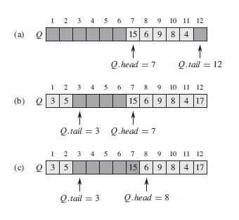
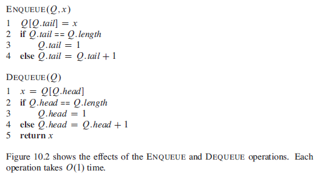
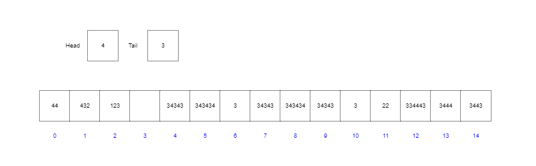

# Queue Data Structure

The queue data structure is also a type of dynamic set, like stack. A queue operates much in the same way as a queue at a super market where a **first in first out (fifo)** policy is in place, this in contrast to a stack where a **last in first out (lifo)** policy is in place.

The insert operation on a queue is called **ENQUEUE**, and the delete operation on a queue is called **DEQUEUE**, like the **POP** operation on a stack, **DEQUEUE** does not take an element to remove, but instead removes the element indicated to be at the *head* of the queue.

A queue has a **head** and a **tail** and when an element is enqueued it takes its place at the tail of the queue, it is last in line to be processed, like a new customer arriving to join a queue at the supermarket. The element that is dequeued is always the element at the **head** of the queue.

## Queue Diagram

  

## Circular Queue

In the diagram above the queue is *circular* in that elements reside within the queue data structure between *Q.head*...*Q.tail - 1* and *Q.tail* always points to the next available slot for an element joining the queue to be placed into, when a queue is initialised *Q.head* = *Q.tail* = 1 (or zero in zero based arrays). If an attempt is made to dequeue an element from an empty queue the queue is said to **underflow**. When *Q.head = Q.tail + 1* the queue is said to be full and any attempts to enqueue a new element will result in a **queue overflow**.

## Pseudocode for Queue Operations

  

# Maximum items in a queue

As the queue is deemed to be full when *Q.head = Q.tail + 1* the queue will always be full at *n - 1*. See the following diagram:

  

