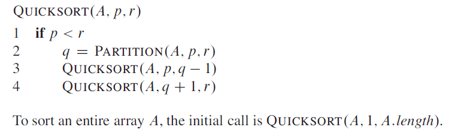
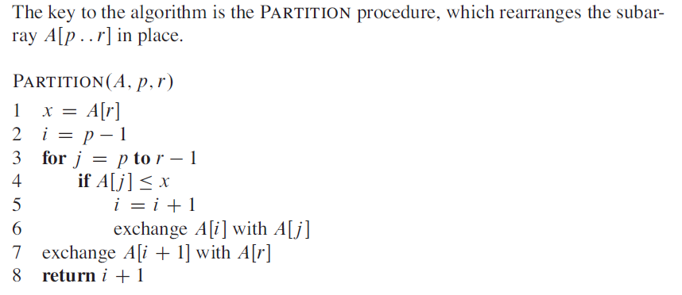

# Quicksort Algorithm

The quicksort algorithm is another ***divide and conquer*** algorithm which usually when implemented well beats a heap sort due to its tight code.

Quicksort was created by British Computer scientist *Tony Hoare* in 1959 and in the worst case has a performance of `O(n^2)` and in the best case has a performance of `O(n log n)`, mathematical analysis shows it has an average performance of `O(n log n)`, although when performing a three way partition it can have a performance of `O(n)`.

Quicksort is known to be around three times faster than its main competitors, *heapsort* and *mergesort*.

Quicksort is ***comparison sort*** which means it sorts using a ***less than*** comparison and is sometimes called ***partition-exchange sort***, Quicksort sorts ***in place*** which means only a constant number of items are ever held outside of the data structure being sorted.

## Quicksort Procedure

Quicksort works using a technique called ***partitioning*** where the array being sorted is a partitioned around some element. There are many ways to do this and the CLRS example selects the last element in the array.

Next two pointers *i* and *j* are created, *i* is set to one less than the start index of the array (first element), *j* is set to point to the first element and will count up to one less than the last element so the pivot is not compared to itself.

Now comparison starts and the *j'th* element is compared to the pivot element, if the *j'th* element is greater than the pivot element, we do nothing except increment *j* so we can compare the next item.

If the *j'th* element is ***smaller*** than the pivot element we increment *i* by one (so it now points to the first element bigger than the pivot) and we then swap the items at *i* and *j* and we continue this process until the array has been parsed for one sweep.

Now the point `i * 1` will point to an item which is smaller than the pivot so the final thing in this pass is to swap the pivot for the element at `i + 1` which means now the array is ***partitioned*** and everything on the left side of the pivot is *less than* the pivot and everything on the right side is *greater than* the pivot.

### Quicksort Pseudocode

  

### Partition Pseudocode

  

