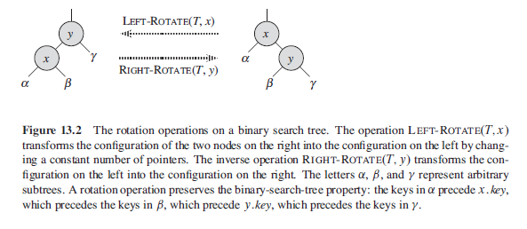

# Red Black Tree Data Structure

A red black tree is a ***self balancing*** and ***roughly height balanced*** binary search tree data structure, where each node is given a colour via an additional bit which represents either the colour red or the colour black.

A red black tree aims to address the balance issues that can arise from insertion into a BST which can end up representing a linked list where the access time is in the order of `O(n)` and so loses it `log n` properties due to the height of the tree increasing, the red black tree does this by rotating and recolouring nodes to maintain a roughly balanced height to the tree of `log n`.

A red black tree is well suited to many inserts and deletes due to the fact that there will be a maximum of two rotations for an insertion or deletion to maintain the red black properties of the tree. Contrast this with an ***AVL tree*** where there may be multiple rotations right up to the root node to maintain the ***strict balancing*** of the tree, this makes AVL trees better suited for fast lookups because the tree is always height balanced but it may perform more slowly for many inserts and deletes although a red black tree does offer a search time of `O(log n)` in the ***worst*** and ***average*** case.

The running time for `SEARCH`, `SUCCESSOR`, `PREDECESSOR`, `INSERT` and `DELETE` operations is `O(h)`. They are analyzed in terms of the height of the binary search tree h instead of the number of nodes in the tree n. The worst case for binary search tree operation becomes `Θ(n)` for a skew tree which is no better than a linked list. Red-black trees are balanced binary trees that guarantee small height `h = O(lgn)`, thus avoiding the worst-case behaviour of binary search trees.

In this lesson, we will explore how red-black trees work. We will start with red-black tree properties, then auxiliary rotating procedures and finally the insertion and deletion operations.

## Properties of a red black tree

* Every node is either red or black
* The root node is always black
* Every leaf (NIL) is black
* If a node is red then both its children are black
* For each node, all simple paths from the node to descendant leaves contain the same number of black nodes

## Red black tree diagram

  

## Rotations

The search tree operations `TREE-INSERT` and `TREE-DELETE`, when run against a red black tree with *n* keys takes `O(log n)`. Because these operations modify the tree the result may violate the properties of a red black tree and in order that these properties are restored rotations and recolouring may need to be performed.

### Tree rotate

  

### Left rotate pseudocode

  

### Left rotate on tree

  

## Insertion

Inserting into a an *n-node* red black tree takes `O(log n)` time, and to do so requires a slightly modified version of the `TREE-INSERT` procedure.

When inserting a node *z* it is inserted as if it were a normal key into a binary search tree and it is the ***coloured red***, to then preserve the red black properties of the tree we then need to call the auxiliary function `RB-INSERT-FIXUP` to recolour nodes and perform rotations.

### Insert Pseudocode

  

### Fixup

  

### Fixup operation on tree

  

### Rules for fixing up

The rules for fixing up a node are as follows:

