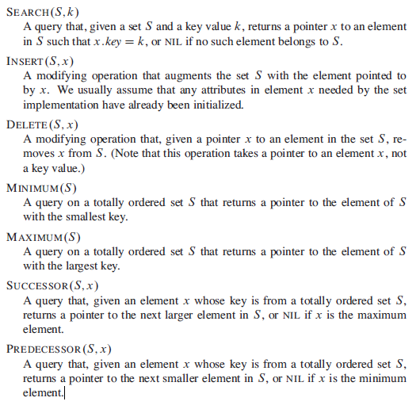
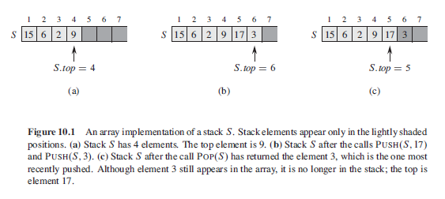

# Dynamic Sets

Mathematical sets are static while sets in Computer Science are dynamic. Elements in a set are represented by an object (say **x**) and an object contains a key field (say **k**) and some *satellite data*. General operations on a dynamic set **S** include:

<p align="left">
  
</p>

## Satellite Data

Satellite data is nothing more than additional data that forms part of an object in a dynamic set, if **k** is the key value in some arbitrary object, and it is this field that is used for sorting purposes then satellite data represents the other properties of this object, other than **k**.

In the following example in C, the key is the **id** field, whilst the fields age and name are satellite data:

```C
struct {
  int id;
  int age;
  char name[50];  
}
```

# Stack Data Structure

The stack data structure is a type of **dynamic set** and a deleted element is the most recent element that has been added to the stack, stacks operate in the sense of real life stacks using a **first in first out** policy. For example a stack of plates where new plates are placed on top, and the most recently added plate (the top plate) is the first to be removed when a new plate is required.

The insert operation on a stack is commonly called a **PUSH** operation and the delete operation on a stack is commonly called a **POP** operation. Stacks track the top element using the property **top** which a pointer to the last entered element in the underlying array or data structure. Stacks also support a method for determining if the stack is empty, for a given stack **S**, if the property *S.top* = 0 then the stack is said to be **empty**.

If an attempt is made to pop an empty stack then a **stack underflow** occurs and we say the stack **underflows**, which usually results in an error, if *S.TOP* exceeds *n* (the length of the array) then a **stack overflow** occurs and we say the stack **overflows**, and this also usually results in an error.

<p align="center">
  
</p>

## Stack Operations

Each of the following stack operations takes O(1) (constant) time.

### EMPTY

```pseudocode
STACK-EMPTY(S)
1 if S.top == 0
2   return TRUE
3 else return FALSE
```

### PUSH

```pseudocode
PUSH(S, x)
1 S.top = S.top + 1
2 S[S.top] = x
```

### POP

```pseudocode
POP(S)
1 if STACK-EMPTY(S)
2   error “underflow”
3 else S.top = S.top - 1
4   return S[S.top + 1]
```
