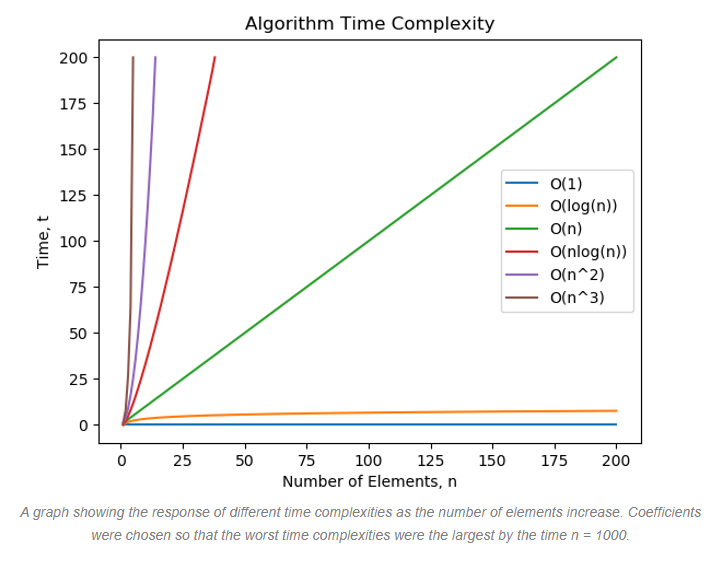

# Time complexity of Algorithms

In mathematical analysis, asymptotic analysis, also known as asymptotics, is a method of describing limiting behavior. When we use big-Θ notation, we're saying that we have an asymptotically tight bound on the running time. **Asymptotically"=** because it matters for only large values of *n*. **Tight bound** because we've nailed the running time to within a constant factor above and below, asymptotic information is related to large input size.

## Time Complexity Table
| Big-Oh | Informal Name |    
|--------|---------------|
| O(1)	| constant |
| O(lgn)	| logarithmic |
| O(n)	| linear |
| O(nlgn) | nlgn |
| O(n2) | quadratic |
| O(n3) | cubic |
| O(2n) | exponential |
| O(n!) | factorial |

## Time Complexity Chart

  

## Amortized Time

A function is said to have an *amortized* time such as O(n)+ if some operations may take longer at times but over averaged over a large number of calls do not affect the overall runtime. A good way to think about this is to think of a dynamic array, now arrays have a size fixed at creation time, consider a dynamic array of size 4, inserting elements 1-4 is constant time O(1), however inserting element 5 will not be because a new array will be created, elements 1-4 will be copied to this new array and then element 5 will be inserted into position 4 of the newly sized array, however the insertion time for a dynamic array is still considered to be O(1).

## Big-O

Big-O notation is used to classify algorithms based on the based on the number of operations or comparisons they use, typically big-O is used to the define the upper bounds, 
or worst case running time of a function. In plain words, Big O notation describes the complexity of your code using algebraic terms.

When we calculate big O notation, we only care about the dominant terms, and we do not care about the coefficients. Since we want to analyze the growth with respect to the input 
size, the coefficients which only multiply the number rather than growing with the input size do not contain useful information. The dominant term is the term that grows the fastest, a good way to think about this is that when **x** gets really large, consider the following: x² + 25x + 2000, when x is a million or a billion, then the values other than x² are insignificant.

For large values of x: x², 3x² + 25, 4x² + 7x + 75 which are all similar we will treat them all as the same order O(x²).

**Big O**: f(n) is O(g(n)) if for some constants *C* and *k*, f(n) ≤ *C* * g(n) for all *n* > *k*

***What this means is that f(n) grows no faster that g(n).***

* g(n) = n²
* c = 1
* N₀ = 0
* n = 1000

Using the above values N² will always be greater than (N²/2) - (N/2)

n² = 1, 000, 000

(N²/2) - (N/2) = 499, 500

When we talk about Big O, we want to know the tight bound of the function so it would not be appropriate to just assign some huge value to g(), such as 2ⁿ.

How can we show that: 3x² + 25 = O(x²)?

**Manually**

f(x) = 3x² + 25

g(x) = C * (x²)

### Assign a starting value to x

x = 5

### Calculate for x

3x² + 25 = 3(5²) + 25 = 3 * 25 + 25 = 100

Now can we prove that: 

*C*(5²) ≥ 100 = *C* * 25 ≥ 100

So we can easily see that **4** fits this because: *4 * 25 = 100*

So using this method we have found values for **k** and **C**: *k* = 5, *C* = 4

Up to this point we have shown that f(x) is *equal* to Cg(x) when k = x and now we need to prove that for all values of x > k this holds true.

x = 6
k = 5
C = 4

f(x) = 3(6²) + 25 = 133

g(x) = 4(6²) = 144

So f(x) is now **bounded** by g(x)

**Now we can bump everything up to the greatest power**

3x² + 25 ≤ 3x² + 25x²

3x² + 25x² = 28x²

3x² + 25x² ≥ 3x² + 25 when x >= 1

It is important to remember that x must be greater than or equal to one for this to be true, because 0.5 * 0.5 = 0.25!

However as long as x > 1 we now have values for C and k:

C = 28
k = 1

We only need to find ***ANY*** C and k value that work.

## Big Omega

Omega(n) is asymptotic lower bound, or best case running time for a function. If T(n) is Omega(f(n)), it means that from a certain *n0*, there is a constant *C1* such that:

T(n) >= C1 * f(n) 

Whereas big-O says there is a constant C2 such that:

T(n) <= C2 * f(n)).

## Big Theta

Big Theta gives both lower and upper bounds, so with Theta notation you know that it will not be faster than Big-O that is, there is no best-case scenario where the algorithm will return faster. If Big-O and Big Omega are the same then a function is said to be Theta(n).

Everything that is Theta(f(n)) is also O(f(n)), but not the other way around. T(n) is said to be Theta(f(n)), if it is both O(f(n)) and Omega(f(n)).
