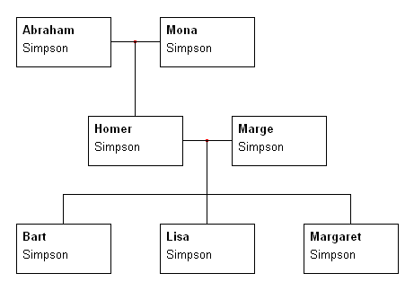
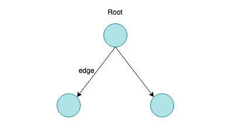
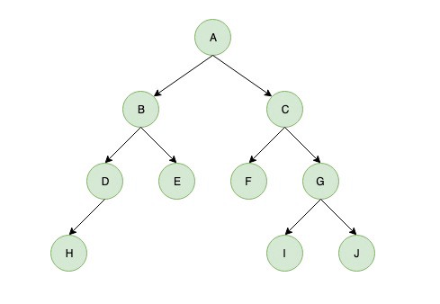

# Tree Data Structures

Trees are *non-linear* data structures that organise their data into a hierarchical structure, much like a family tree where each node (person) could have *parents*, *siblings*, *children*, *grandparents*, *ancestors* and *successors* and so forth.

## A family tree

  

A data structure which is a tree can be thought of as a collection of nodes, where each node is connected together by an *edge*. Each node contains some data which represents its *value* and it may, or may not have a child node. In any *non empty* tree the first node will be called the **root**.

  

A tree can consist of many sub trees and if a *root node* is connected to one of more nodes it will be the parent node, and the connected nodes will be its *children*. A node with **no children** is called a **leaf node**, or an **external node**, nodes with children and which are not leaf nodes are called **internal nodes**.

An internal node will always have at least one child node, and nodes with the same parent are said to be **siblings**.

The **depth** of a node is the number of edges from the root to the node, and the **height** of a node is the number of edges from the nearest leaf to the node.

  

In the diagram above:

* **A** is the **root** node of the tree
* **A** is the parent of **B** and **C**
* **B** is the **root** of a separate sub tree
* **B** and **C** are ***siblings***
* **E**, **F**, **H**, **I** and **J** are **leaves**
